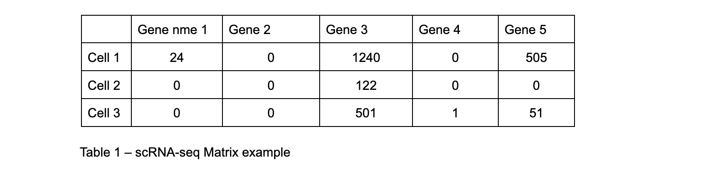
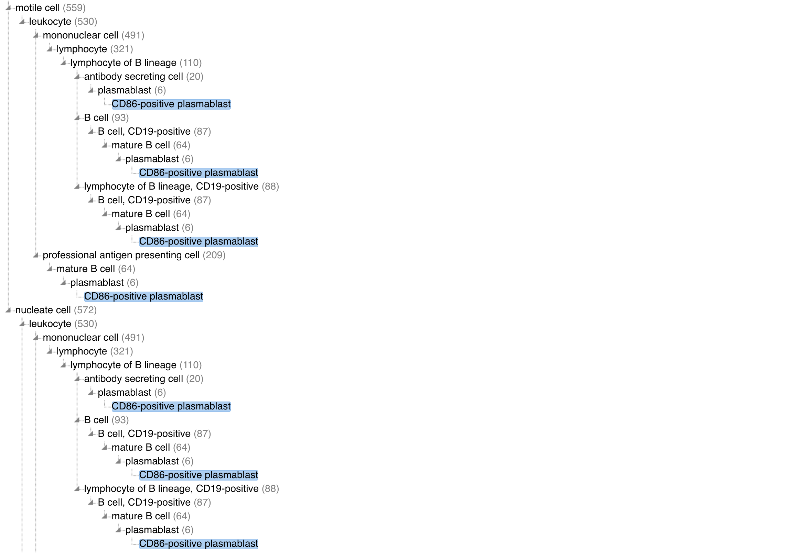

# NEU | Broad Challenge Description
## Description

Cell Annotation Service (CAS) is a tool that can be used for a rapid search of the cells based on their raw count matrices. This service can be used by analysts to perform annotation and search of their cells.
## Data
The Raw Count Matrix in scRNA-seq data is a sparse, high-dimensional array where each column represents a gene, and each row represents a cell from the tissue. Each value in the matrix indicates the count of a particular gene expressed in a specific cell during the experiment, based on the RNA molecules captured by the sequencing machine. The scRNA-seq data is structured as follows:



Typically, these matrices have 30,000 to 40,000 columns and can vary in the number of rows, sometimes reaching several millions. Most of the values represent 0, just a small portion of the values in the matrix has numbers other than 0.

## Data Flow of Cell Annotation
1. Dimensionality reduction.
   First scRNA-seq data comes from the client and goes through dimensionality reduction (PCA). As the output PCA gives us 512 dimension vectors.
2. Nearest Neighbor Search
   Then 512 dimension representations of the input cells go to a Nearest Neighbor Search engine, which returns an array of cells that are close to the querying cell (potentially meaningful biological context).
   Let’s say for our input example (Table 1) we have an output like this:
```JSON
[
 {
   "query_id": "Cell 1",
   "matches": [
     {"id": 12321, "cell_type": "T cell", "distance": 0.789},
     {"id": 123145, "cell_type": "lymphocyte", "distance": 0.790},
     {"id": 1231, "cell_type": "alpha-beta T cell", "distance": 0.80}
   ]
 },
 {
   "query_id": "Cell 2",
   "matches": [
     {"id": 113543, "cell_type": "MHC-II-negative non-classical monocyte", "distance": 0.812},
     {"id": 1908, "cell_type": "native cell", "distance": 0.701},
     {"id": 12, "cell_type": "leukocyte", "distance": 0.67}
   ]
 },
 {
   "query_id": "Cell 3",
   "matches": [
     {"id": 1012342, "cell_type": "MHC-II-negative non-classical monocyte", "distance": 0.93},
     {"id": 56753,"cell_type": "Gr1-low non-classical monocyte", "distance": 0.82},
     {"id": 623456, "cell_type": "leukocyte", "distance": 0.710221}
   ]
 }
]
```

This would help us to annotate the query cell with the cell type returned from the Nearest Neighbor engine.

3. Summarize context based on Nearest Neighbor Search output (the step that needs action)

## Problem
Cell Type is a categorical variable. Hierarchy of cell types is represented by [Cell Type Ontology](https://en.wikipedia.org/wiki/Ontology_(information_science)).
Having all those neighbors in our response is hard to interpret for the annotation as sometimes the response has multiple reasonable matches. Our reference datasets are annotated at different levels of the cell ontology.  As a result, a similarity query results in a mixture of annotations at different granularities.
Attention: the complexity of the problem lies in the fact that higher level cell types belong to multiple lower cell types in hierarchy, however those lower level cell types (which are all parents for the lower level cell type) can have different parents and have no connection. Example:

Let’s take a look at [CD86-positive plasmablast](https://www.ebi.ac.uk/ols4/ontologies/cl/classes/http%253A%252F%252Fpurl.obolibrary.org%252Fobo%252FCL_0001202?lang=en) in the ontology graph.
It has different branches of parents:



It can be a leukocyte and a motile cell, and both of these will be true. If we go to a deeper level, we can see that it belongs to the antibody-secreting cell, B cell, and lymphocyte of B lineage. Having a result predicting any of these classes would be meaningful.
When the nearest neighbor search returns results with various cell types, we need to ensure that we aren't using cell types that are too granular, as this risks deviating too far from the ground truth. Similarly, we should avoid generalizing too much with a parent cell type that doesn't accurately represent the cell.

## Challenge
Develop an algorithm that, based on the response from the nearest neighbor search engine, can return a reasonable aggregation of cell types while ranking them.
You are required to propose the algorithm and describe it in detail. While the code for the prototype is not mandatory, it would be a valuable addition. Please include the resources you used, such as links to papers or articles.

### Submission
Send your submission work to:

fgrab@broadinstitute.org

before May 30, 2024

Feel free to use the same email if you have any questions regarding the challenge task
